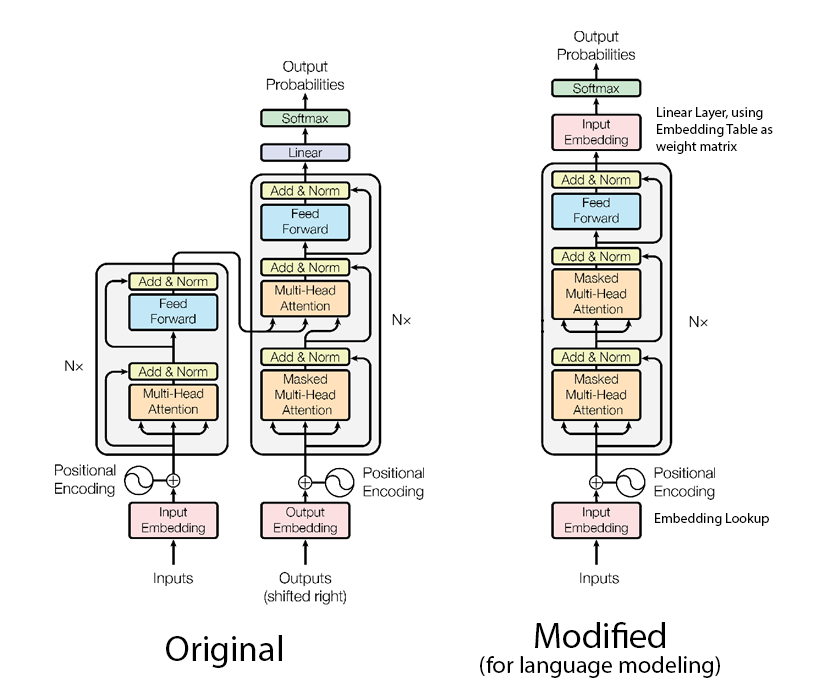
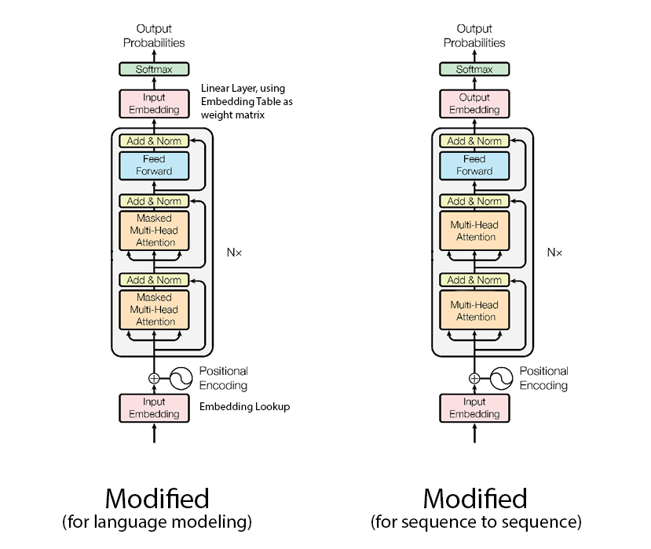

# VN-Accent-Restorer

This project applies multiple deep learning models to the pointless problem of restoring diacritical marks to sentences in Vietnamese.

E.g: ```do an dem trang beo``` → ```đồ ăn đêm trang béo```

## Beamsearch and Language Model

Using a language model, we basically try to guess the next word in the sequence using the previously decoded words to obtain one with the lowest perplexity.
Since using a pure greedy algorithm will make us unable to correct a past mistake, beamsearch will be used along with it.

In this project I implemented two kind neural language models. The traditional RNN model [cite] and a modified version of the Transformer model ([Vaswani et al](https://arxiv.org/abs/1706.03762)), originally used 
for sequence to sequence tasks ([Liu et al](https://arxiv.org/abs/1801.10198)).


Basically we throw away the encoder block, reducing training time and model size in half. Also in the final linear projection layer we try to re-use the word embedding table as the weight matrix ([Press et al](https://arxiv.org/abs/1608.05859))

Although not explicitly mentioned in the original paper, without both attention blocks being masked i.e preventing information from the future to flow back to the current input, training a language model won't work.
The model will cleverly learn to shift the input data to the left by one time step and converge very quickly, without actually understanding anything.
## Sequence to Sequence Model
The same Transformer-Decoder can be used as a end-to-end solution to this problem by modifying the input and training target a little bit.



Note that we're not generating the output autoregressively like in the original Encoder-Decoder architecture. Instead we can simply generate the whole output sentence at once. This is fast, but at the cost of no flexibility e.g no beamsearch allowed.